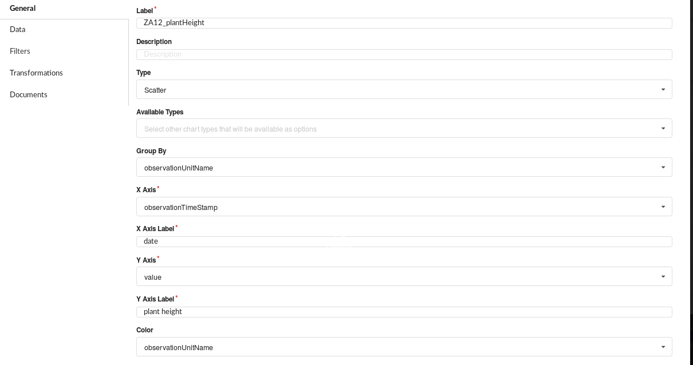

# AGINFRA+ data science workshop

## PLANT PHENOTYPING EXPERIMENTS ANALYSIS

1. Accessing the Food Security VRE
2. Exploring phenotyping studies
3. Retrieve data
4. Visualize data
5. Analyze data

### 1. ACCESSING THE FOOD SECURITY VRE

To access the VRE, open a web browser and go to the website : https://aginfra.d4science.org/
On this AgInfra+ Gateway site, please log in with your account details.

You should see the VREs that are accessible to you. Select the Food Security VRE. This will open the website in your browser.
 

### 2. EXPLORING PHENOTYPING STUDIES AND RETRIEVING DATA
Open the Studies Exploration. Select the server PHIS_SANDBOX.

 

You should see at least 2 studies. In this exercise we will work with the study ZA12 data. We are interesting in plant height data. Let's check if there are plant height data on this study.

Copy the ExperimentURI and go to the tab "Preview study observations".
You can see the first observations measurements of the study.


### 3. RETRIEVE DATA
You will use a dataminer algorithm to get all data of the ZA12 study.
Go to *Analytics/Dataminer* to execute the algorithm **Brapi Get Studies Observations**. (this algorithm is inside the category "Data extraction")

Fill the different parameters as presented below (the login and password parameters can be used to access to private studies): 

 
Then *Start Computation*

You should see this execution loading bar :


This algorithm creates a csv file and a json file with the study data. They are stored in your workspace under the dataminer folder.

### 4. VISUALIZE DATA
There are 2 ways to visualize the data. You can do it by using the visualization tools or you can use Rstudio to generate graphs.

#### A. Visualize data in the visualization tool
The workspace is not integrated with this tool yet. So you will first need to download the csv file created by the dataminer. 
If you didn't do it at the end of the dataminer computation, you can go to your workspace: button  at the upper left corner. The files are stored in DataMiner/Output Data Sets.

When you have downloaded the csv file, you can go to the *visualization/Create Graphs* to create a new graph.

In Data, upload the csv file you got from the studies exploration tool. 

Fill the General tab this way :



You can go to *visualization/Create Graphs* and see your chart.


#### B. Visualize data in Rstudio
An other good way to visualize data is to use R. Indeed there are great packages such as ggplot2 to build charts. There are also very helpfull galleries with a lot of code examples (https://www.r-graph-gallery.com/)

Go to *Analytics/Rstudio* to open **Rstudio**. Find your data csv file (created by the dataminer) in the *Files* tab at the bottom right corner. It is stored in your workspace under *DataMiner/Output Data Sets* folder.

Click on the file to "import Dataset". 


Now you can  use the R console to visualize your data. To create a simple chart, you can use the code bellow which creates the following chart: 
```
library(ggplot2)
ggplot(data = outputCSV) + 
  geom_point(mapping = aes(x = observationTimeStamp, y = value, group = observationUnitName, color = observationUnitName))

```


### 5. ANALYZE DATA


#### A. Reuse an algorithm to detect outliers
You would like to detect the outliers on your data. To do that, you could use Rstudio (or even Juppyter) and make a script.
But you are very lucky, another VRE member has already done a similar script and he has imported it in the dataminer tool as a black box (the algorithm name is **Get Time Series Outliers**). So all you need is to go to your workspace and right click on your data csv file and select "execute DM task". 


Fill the parameters as bellow: 


*Parameters description* : 
If removeOutliers=0 the outliers will be kept and identifiable.
If createPDFwithPlots=1 a pdf file with plots of each time serie will be created

Click on *Create configuration*, then run the algorithm.

After the execution, you should find the output files in your workspace (*dataminer/output data sets folder*)

#### B. Make a Galaxy workflow

You would like to be able to access data from PHIS studies and detect outliers in a single process as a routine, so that you could easily do the same process on next studies. 
To do that, you can build a workflow in Galaxy. Galaxy can be found in the analytics tab.
The dataminer algorithms are automatically transfered as galaxy tools. 
Build a workflow which first Retrieve observation data of the study ZA12 and then detects outliers. 

*Tip : you need to use node csv_extractor in order to convert the dataminer tools output into csv*

You should have a workflow looking like this : 


**Don't gorget to save you workflow by clicking on** 

When your workflow is ready, you can run it. You can see each step execution on the right of the screen.


After the workflow execution, you can view the outputs. You can click on the view button on the 3rd step (Dataminer output for get_time_series) where you can click on the 2 output files to download them.

The csv validator tool enables to convert the dataminer csv output into a galaxy datatable file which means that it can be reused as an input on another galaxy tool and you can visualize the data directly in Galaxy. To do that, you can click on the view button of the last step of the workflow.
