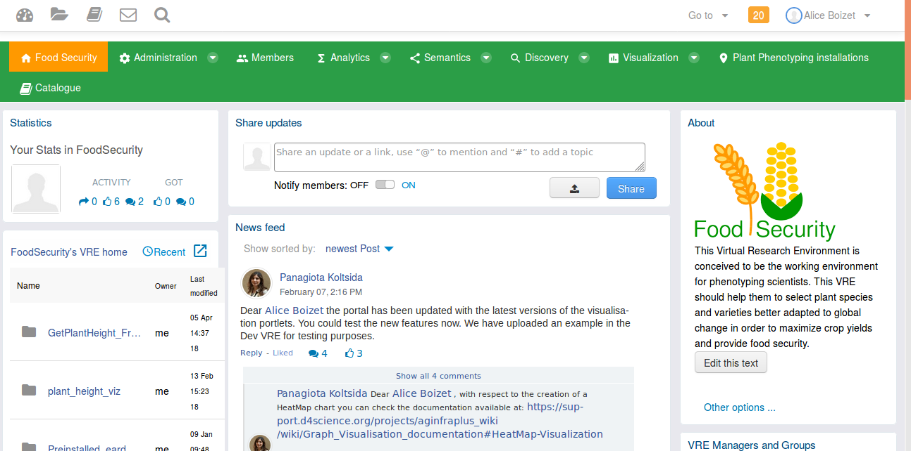

# Présentation du VRE Food Security

## Qu'est ce qu'un VRE ?
Un VRE (Virtual Research Environment) est un environnement de travail virtuel et collaboratif à destination des chercheurs.
"Il est constitué par un ensemble d’outils et de ressources en ligne rendues interopérables dans l’objectif de faciliter les processus de recherche au sein et entre les institutions. La caractéristique essentielle d’un VRE est de faciliter la collaboration entre les scientifiques." [source IFB](https://www.france-bioinformatique.fr/en/groupes-de-travail/virtual-research-environment)

Le fait qu'il soit virtualisé permet tout d'abord au chercheur de travailler sur son environnement depuis n'importe quel machine : ses données sont stockées dans le VRE et des outils (tels que Rstudio) permettant d'analyser les données sont accessibles directement dans le VRE.

Un espace de travail partagé permet aux chercheurs de partager leurs données ou processus de traitement et ainsi de collaborer plus facilement.

## Projet AgINFRA+
AGINFRA + vise à exploiter les e-infrastructures telles que l'EGI et D4Science, pour fournir des VREs adaptés à certaines communautés de chercheurs autour de l' agriculture et  de l'alimentation.

À cette fin, le projet a mis en place plusieurs VRE pour 3 communautés :
- la communauté de la modélisation agro-climatique
- la communauté de la sûreté alimentaire
- la communauté de la sécurité alimentaire.

Le but du projet est d'alimenter ces VREs avec différents composants répondant aux besoins de chaque communauté. Ainsi, des fonctionnalités permettant le développement rapide et intuitif de workflows variés d’analyse de données ont été intégrées ainsi que des outils de visualisation de données.

## Food Security VRE

Le Food Security VRE est porté par la plateforme D4Science, développée par le CNR.
[https://aginfra.d4science.org/group/foodsecurity](https://aginfra.d4science.org/group/foodsecurity)
Pour la communauté "Food Security", le cas d'utilisation choisi est le phénotypage de plante haut-débit qui produit de gros volumes de données variées.

# Evaluation des fonctionnalités

## Objectifs et déroulement de l'évaluation
Le but de l'exercice est d'évaluer si un VRE et plus particulièrement le VRE "Food Security" est un outil qui peut faciliter les travaux de recherche en phénotypage.

Après la présentation des différentes fonctionnalités du VRE, vous allez être amenés à suivre un scénario utilisateur permettant de tester chacune de ces fonctionnalités.
Ensuite vous pourrez répondre à un questionnaire dans lequel il faudra noter chaque fonctionnalité suivant différents indicateurs.

## Scénario utilisateur

### Inscription/connexion au VRE
Rendez-vous sur [https://aginfra.d4science.org/group/foodsecurity](https://aginfra.d4science.org/group/foodsecurity).
Si vous êtes déjà inscrit, connectez-vous directement et passez directement à l'étape suivante. Sinon, inscrivez-vous au VRE (par la méthode de votre choix)

### Accéder à des données



#### L'espace de travail
- Le workspace
Cliquez sur .
Dans le répertoire VRE Folders, vous accédez à l'espace commun de chaque VRE auquel vous êtes inscrit. Les fichiers que vous déposerez dans VRE Folders/Food Security VRE seront donc accessibles aux autres membres du VRE.
Les répertoires et fichiers créés à la racine du workspace sont privés.

- La messagerie
Cliquez sur .
Vous avez la possibilité d'utiliser cette messagerie pour envoyer des messages privés aux membres du VRE.

- Le catalogue
Cliquez sur .
Le catalogue recense les ressources disponibles sur le VRE. Son utilisation sera expliquée dans une autre partie

#### Refindit
Allez dans Discovery/Refindit. Cherchez une publication (exemple : la publication sur PHIS : P. Neveu, A. Tireau, N. Hilgert, V. Nègre, J. Mineau-Cesari, N. Brichet, R. Chapuis, I. Sanchez, C. Pommier, B. Charnomordic, F. Tardieu, L. Cabrera-Bosquet, Dealing with multi-source and multi-scale information in plant phenomics: the ontology-driven Phenotyping Hybrid Information System, New Phytol., 221 (2019) 588-601. doi: 10.1111/nph.15385)

#### Récupérer des données depuis les Web Services BrAPI
BRAPI (pour Plant Breeding API) est une spécification d'un standard d'API pour les données en phénotypage et génotypage. Toutes les API respectant ce standard pourront donc être appelées de la même manière, ce qui facilite l'accès et l'échange des données.

1. Allez dans l'application Brapi Data Exploration  
*Non Disponible pour le moment*

2. Récupérer des données de PHIS grâce aux services BrAPI

Allez dans *Analytics/Data Miner*. Cliquez sur *Execute an experiment*.
Dans le menu sur la gauche, cliquez sur *Data Extraction* et *Brapi_Get_Studies_Observations*

Remplissez les différents champs avec les paramètres suivants et cliquez sur *Start Computation*
- DBServerURL : http://138.102.159.37:8080/openSilexTestAPI/rest 
- studies : http://www.phenome-fppn.fr/test/DMO2019-6 
- variables : all 
- login : admin@opensilex.org 
- password : 21232f297a57a5a743894a0e4a801fc3 


### Les environnements de développement
- Rstudio
Allez dans *Analytics/Rstudio*
Dans le cadre en bas à droite, parcourez les répertoires pour retrouver le fichier de données créé par Data Miner. 
Le répertoire *Workspace* correspond au workspace du VRE. Allez dans *Workspace/DataMiner/output_dataset

Ecrivez un script R court qui lit les données de ce fichier et qui crée un fichier en sortie (*ex : un fichier texte avec la moyenne des mesures*)


- JupyterLab
Allez dans *Analytics/Jupyter*
Vous accéder alors à l'outil Jupyter qui permet de créer des notebooks dans différents langages.


Créez un notebook R ou python et exécuter quelques lignes de codes simples. ([Voir la documentation](https://www.dataquest.io/blog/jupyter-notebook-tutorial/))
Le notebook créé se trouve à côté de 2 répertoires *persistent* et *workspace*. Vous pouvez déplacer votre notebook dans l'un des 2 répertoires. 

Le *workspace* correspond au workspace du VRE. Les fichiers stockés dans *persistent* ne seront pas accessible depuis le workspace du VRE.
Si vous laissez votre notebook en-dehors de l'un de ces 2 répertoires, celui-ci ne sera pas sauvegardé.

### Rendre ses scripts exécutables par n'importe qui (SAI)
Vous allez importer un script R dans le Data Miner afin de pouvoir l'exécuter comme une boîte noire.  
Ci-dessous, vous avez pour exemple un script qui prend comme paramètres un fichier csv et le nom de la colonne sur laquelle calculer une moyenne et qui renvoie un fichier avec la moyenne
```
inputFile = "test_data.csv"
inputColumnName = "value"
outputFile = "monFichierMoyenne.txt"

myData = read.csv(inputFile, sep=",")
moyenne = mean(myData[[inputColumnName]])
write.table(moyenne, outputFile, append = FALSE, sep = " ", dec = ".",
            row.names = FALSE, col.names = FALSE)
```

#### 1. Création du répertoire de travail
Allez dans votre workspace et créer un répertoire dans lequel vous déposerez votre script.

#### 2. Création d'un nouveau projet data miner
Allez dans *Analytics/Import a new method*
Cliquez sur *Create a project*
Sélectionnez le type de projet : R et validez
Sélectionnez le répertoire précédemment créé et cliquez sur *Finish*

Vous arriverez alors sur cet écran :


#### 3. Import du script
Dans le panneau project explorer, vous devez voir votre script R. (Lorsque vous créez un nouveau projet, vous pouvez le créer sur un répertoire vide et ajouter ajouter le script directement depuis votre machine avec un cliquer-déposer dans le *project explorer*)

#### 4. Infos de l'algorithme
Remplissez les champs Name, Description et Category du panneau Input/Info (Le champ category correspond à la rubrique dans laquelle se trouvera l'algorithme créé)
Attention : Le nom de l'algorithme sert d'identifiant, il doit donc être unique. 

Si vous cocher le champ *Private*, l'algorithme ne sera pas visible par les autres membres du VRE. 

#### 5. Définir le script principal
Dans le projet, vous pouvez également importer d'autres fichiers (fichier de fonctions R, fichier de données)
Vous devez donc définir quel script doit être lancé lors de l'exécution de l'algorithme. Pour cela, sélectionnez votre script et cliquez sur "Set Main".
Le contenu du script s'affiche alors dans le panneau de gauche. 

Vous pouvez modifier votre script directement dans cette fenêtre et le sauvegarder avant de publier l'algorithme.

#### 6. Définir les inputs et outputs
Vous devez définir les inputs et outputs du script.
Sélectionner la ligne contenant un input puis cliquer sur *+Input*. Un input doit alors apparaître dans le panneau Input (les informations sont entrées de manière automatique). 

Faîtes de même pour les autres inputs et outputs.

#### 7. Définir l'interpréteur
Dans le panneau Input/interpreter, précisez "R" dans la version.

#### 8. Publier l'algorithme
Cliquer sur le bouton *Publish* et cliquer *Yes* au message de confirmation
A chaque fois que vous modifier une information relative à l'algorithme (description, input/output...), vous devez republier l'algorithme. Dans le cas où vous ne modifiez que le script, vous pouvez alors juste cliquer sur *ZIP repackage*.

#### 9. Lancer l'algorithme
Déconnectez-vous et reconnectez-vous au VRE. Allez dans *Analytics/Data Miner > Execute an Experiment* puis exécutez l'algorithme créé.


### Réaliser des workflows de traitement (Galaxy)

Allez dans *Analytics/Galaxy*. Vous arrivez alors sur la page de Galaxy.
Dans la barre du haut, cliquez sur *workflow*, cliquez sur le + pour créer un nouveau workflow : renseignez un nom et cliquez sur *Save*.

Vous allez créer un workflow qui contient 3 étapes : donc 3 tools
La 1ère étape récupère les données d'observations de PHIS grâce à l'algorithme data miner utilisé auparavant.
Tous les algorithmes du dataminer sont convertis automatiquement en *"tool"* Galaxy : ceux-ci se trouvent dans la rubrique DataMiner. 
Cliquez sur le *"tool"* BRAPI_GET_STUDIES_OBSERVATIONS. Dans le panneau *Details* sur la droite, renseignez les différents paramètres : 
- DBServerURL : http://138.102.159.37:8080/openSilexTestAPI/rest 
- studies : http://www.phenome-fppn.fr/test/DMO2019-6 
- variables : all 
- login : admin@opensilex.org 
- password : 21232f297a57a5a743894a0e4a801fc3 


La 2ème étape consiste à convertir la sortie du dataminer en fichier CSV 
Cliquez sur le *tool* *CSV extractor* dans la rubrique Data Miner.

La 3ème étape va utiliser l'algorithme DataMiner que vous avez créé.
Cliquez sur le tool *test_data*.

Reliez les 3 noeuds comme dans l'image ci-dessous


Cliquez sur  puis *save* pour sauvegarder votre workflow
Cliquez sur   puis *run* pour le lancer.

### Publier ses données dans le catalogue

#### Publier des données dans le catalogue  
Importez un fichier dans votre workspace
Cliquez sur *Catalogue*


Cliquez sur *Publish Item*
Remplissez les informations obligatoires.
Dans *Tags*, entrez un terme puis validez avec la touche entrée de votre clavier. Vous pouvez en ajouter plusieurs.
En fonction du *type* sélectionné, les informations demandées à la suite diffèrent d'un type à l'autre. Par exemple, pour le type maizeExperiment et wheatExperiment, il vous sera demandé de préciser la ou les variables mesurées. La liste de ces variables provient de la crop ontology (*maize ontology* pour le maïs et *wheat ontology* pour le blé)

#### Rechercher des données via le semantic search
*Non disponible pour le moment*

### L'envoi de messages
Informez les membres du VRE les membres du VRE de l'ajout d'un nouveau dataset en ajoutant un message dans le fil d'actualités. Vous pouvez taguer une personne en particulier en utilisant *@*


### Visualisation de données
L'outil de visualisation permet de créer des graphiques facilement à partir d'un fichier CSV.

#### Créer un graphique
Allez dans *Visualization >> Create Graphs*

Dans Data, vous pouvez importez un fichier csv avec un cliquer-déposer.
Dans les autres onglets, vous préciser le type de graphiques et les colonnes correspondant aux données à visualiser.
Pour plus d'informations, veuillez consulter la documentation de l'outil : [documentation visualisation](https://support.d4science.org/projects/aginfraplus_wiki/wiki/Graph_Visualisation_documentation#HeatMap-Visualization)

#### Visualiser des graphiques
Allez dans *Visualization >> Create Graphs*
cliquez sur la liste *Select chart*
Sélectionnez le graphique *Plant height with images*
Sélectionner un génotype en bas du graphique puis cliquez sur un point du graphique. L'image correspondant à la donnée mesurée appraît alors.

### Outils sémantiques
Plusieurs outils de sémantiques sont disponibles

#### Vocbench
Vocbench est un logiciel permettant de créer des ontologies.
Les ontologies GACS, maize ontology, wheat ontology, trait ontology, etc... ont été importées dans Vocbench.
Pour accéder à Vocbench, allez dans *Semantics >> Vocbench*.
Cliquez en haut à droite sur current project pour sélectionner une ontologie.


Cliquez sur data pour parcourir l'ontologie


#### WebVowl
WebVowl est un outil intéressant pour visualiser facilement une ontologie. C'est utile pour des ontologies relativement petites.
Allez dans *Semantics >> Ontology visualization*.

Cliquez en bas sur *Ontology* pour sélectionner une ontologie ou en importer une nouvelle 

#### yam++
Allez dans *Semantics >> Ontology matching*. Si vous le souhaitez, vous pouvez comparer 2 ontologies

#### openrefine
OpenRefine permet notamment de convertir un fichier csv en rdf
Allez dans *Semantics >> OpenRefine*

#### Silk worbench
Silk est un outil permettant de faire du data linking
Allez dans *Semantics >> Data Linking*.

## Remplir le questionnaire
Vous devez avoir reçu par mail une invitation pour remplir un questionnaire.
Cliquez sur *Participate Now* pour ouvrir la page.

Pour chaque fonctionnalité, il vous est demandé de donner une note entre 1 et 5 sur plusieurs critères:
- **Facilité d'utilisation** : 1 si très difficile, 5 si très facile.
- **Utilité de la fonctionnalité** : 1 si inutile, 5 si très utile 
- **Intérêt de l'outil dans le VRE** : 1 si l'outil présente peu d'intérêt à être intégré dans un VRE, 5 si le fait que l'outil soit dans le VRE apporte de la plus-value à l'outil.
- **Aide à rendre les données/scripts FAIR** (Findable Accessible Interoperable Reusable) : 5 si la fonctionnalité permet vraiment de les rendre FAIR
Il vous est également demandé de donner quelques informations libres sur chaque fonctionnalité.

Une fois le questionnaire rempli, cliquez sur *Send answers*
